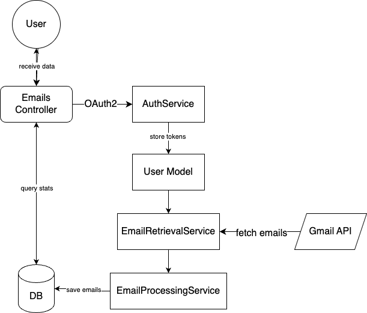

<!--
# @title Planning
-->

# Planning

This part of docs contain my initial plans of developing app.

## Planned Data Flow of the App

## Assumptions

- I will develop basic UI (it was specified that for tools i should use chrome so to simplify walk through the app)
- I will use PostgreSQL
- Authentication with Google OAuth 2.0: For secure user login and access to Gmail data.
- Download All Emails Initially: To have a comprehensive dataset in the DB, allowing for complex queries without repeated API calls. (adjustment): Date Range Download Implementation: To enhance efficiency by fetching emails within a specified range.
- Implement Error Handling and Token Refresh Functionality: To manage API access issues and maintain continuous operation.
- I will use google_api_client because, gmail gem is deprecated
- I will use ransack for search feature instead of elasticsearch beacuse it is pretty simple search and using elasticsearch would be a exaggerated

## 1. Preliminary Planning

- Develop a Data Flow Diagram
- Document Scenarios and Exceptions

## 2. Rails Application Setup

- Initialize Rails Application: With PostgreSQL as the database.
- add essential must-have gems
- add configuration to rubocop 
- install rspec

## 3. User Authentication Setup

- Install Devise Gem: Add and configure Devise for user authentication.
- Setup Google OAuth: Configure Google OAuth for user authentication.

## 4. Model Creation and Association

- Create User Model: Define the User model with necessary fields.
- Create Email Model: Define the Email model with fields like sender, subject, email_date.

## 5. Email Retrieval Functionality

- Build EmailRetrievalService: Develop a service to interact with the Gmail API.
- Implement Email Parsing: Parse email data (sender, subject, date) from API responses.
- Save Emails to Database: Write functionality to save parsed emails to the database.

## 6. Web Service Development

- Configure Routes: Set up routes for the new web service endpoints.
- Develop EmailsController: Create actions for counting emails, listing subjects, and other stats.
- Integrate Ransack for Searching: Implement Ransack for handling search queries.
- Create Basic UI (views for count, subjects, stats, login etc.)

## 7. Error Handling

- Implement API Error Handling: Catch and handle errors from Gmail API in GmailAdapter.
- Token Refresh Logic: Set up a mechanism to refresh expired Google API tokens.

## 8. Testing

- Controller Testing: Test controller actions and responses.
- Test Gmail Adapter
- Test models
- Test Services

## 9. Optimizing Email Retrieval

- Implement Date Range Retrieval: Enhance the EmailRetrievalService to fetch emails within a specific date range.
- Setup Background Jobs: Configure Sidekiq (or similar) for asynchronous email retrieval.
- Create Sync Mechanism: Develop logic to prevent re-fetching of emails for dates already in the database.

