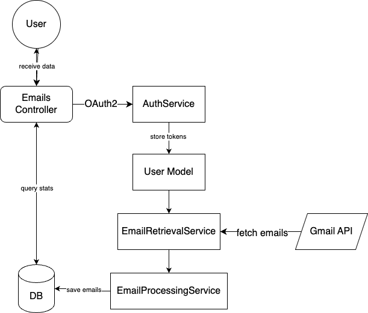

# Description
The application is a web service that interfaces with Gmail to retrieve, process, and analyze a user's email data. It allows users to log in via OAuth2, search and retrieve emails from their Gmail account and store these emails in a database. The web service provides functionality to query the database for statistics and other email-related information, such as the number of emails received on a certain date, a list of email subjects from a particular date, and the most frequent email sender.

## Data flow
Data flow refers to the movement of data within an information system, application, or between systems. It encompasses the path that data takes from its creation to its final destination.

# Class Descriptions

## GmailAdapter
This class serves as a bridge between your application and the Gmail API. It initializes with a user's credentials and contains methods to list messages and fetch individual emails. It handles API calls and encapsulates error handling for authorization issues, rate limits, and general errors.
### Methods
- `list_user_messages` - Public method that lists the messages in a user's Gmail account. It accepts parameters for label ID, maximum results to return, and a page token for pagination.
- `get_user_message` - Public method that retrieves a specific message from the user's Gmail account by message ID. 
- `setup_gmail_client` - Private method that creates a new instance of the Google::Apis::GmailV1::GmailService and configures it with the user's credentials.
- `user_credentials` - Private method that constructs a Google::APIClient::ClientSecrets instance using the user's OAuth2 tokens and the application's client ID and secret. This is used to authorize the Gmail client.
- `safe_api_call` - Private method that attempts to execute a block of code that makes an API call, handling common errors like authorization errors and rate limits. It retries the call a specified number of times before raising an exception.
- `handle_authorization_error` - Private method that is called when an authorization error is caught in safe_api_call. It attempts to refresh the user's token.
- `refresh_token!` - Private method that requests a new access token using the user's refresh token and updates the user's credentials in the database with the new token.
- `update_user_credentials` - Private method that updates the user's stored access and refresh tokens in the database after successfully refreshing the token.
- `handle_rate_limit_error` - Private method that logs a rate limit error and retries the API call after a brief pause. It increments a counter each time to limit the number of retries.

## EmailProcessingService
This service class processes raw email data retrieved from the Gmail API. It builds and saves email records to the database within a transaction, ensuring that all records are saved or none if an error occurs.
### Methods
- `process_and_save_emails` - Public method that processes a list of email data fetched from the Gmail API and saves them as email records in the database. It ensures that all emails are saved within a database transaction, providing atomicity. If an error occurs during the save operation, it logs the error and returns a failure message.
- `build_email_record` - Private method that constructs a hash representing an email record from the raw Gmail message data. It extracts necessary fields such as the sender, subject, and date from the email headers.
- `save_email_records` - Private method that performs a bulk insert of email records into the database using the insert_all method provided by ActiveRecord.
- `find_header_value` - Private helper method that searches through an array of email headers and returns the value for a specific header name.
- `parse_date` - Private helper method that parses a date string into a DateTime object.

## EmailRetrievalService
This service class interacts with the GmailAdapter to fetch all emails or the last email from the Gmail API. It contains methods to process messages in batches and handle pagination with the Gmail API.
### Methods
- `fetch_all_emails` - Public method that retrieves all email messages from the user's Gmail inbox. It accumulates the emails into an array by repeatedly calling process_messages until all messages have been fetched.
- `process_messages` - Private method that handles the retrieval of email messages in batches. It uses the GmailAdapter to list messages and then individually fetches each message's details. It continues fetching messages in a loop, using a page token for pagination until no more messages are available.

## EmailsController
A Rails controller that handles HTTP requests related to emails. It uses various actions to display email data, count the number of emails based on a search query, and show email subjects and general email statistics to the user.

## Email Model
An ActiveRecord model representing the email records in the database. It includes associations to the User model and specifies which attributes are searchable with Ransack (a gem for creating search queries).

## User Model
Another ActiveRecord model that represents users of the application. It handles user authentication with Devise and OmniAuth for Google OAuth2, manages user sessions, and stores tokens and user identifiers. It also has a relationship with the Email model, indicating that users have many emails.

## EmailSyncJob
This is a background Job that runs EmailRetrievalService and EmailProcessingService as a background job and when it is finish it sends message to ActionCable to let know when the job is done.

## EmailSyncChannel

The EmailSyncChannel class is an Action Cable channel in a Rails application, designed to handle real-time WebSocket connections related to email synchronization for individual users. It's purpose is to wait for the message from EmailSyncJob when it's done downloading emails and redirect user to emails dashboard
